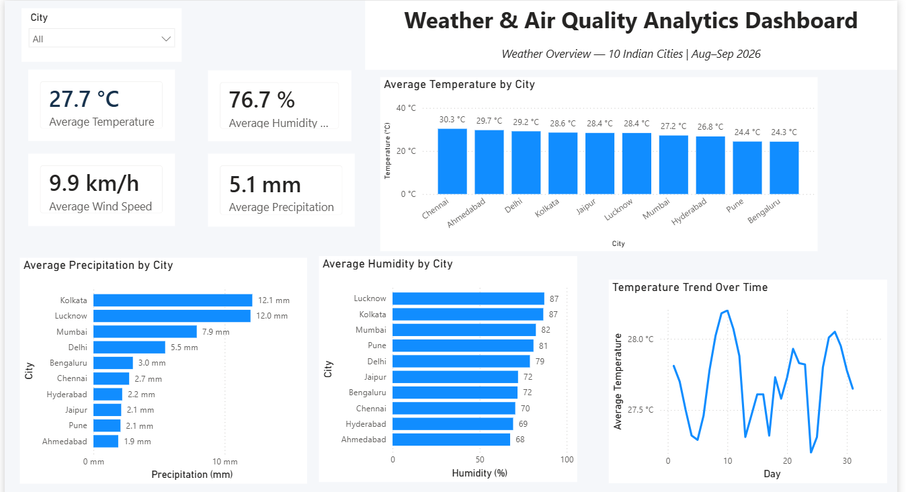
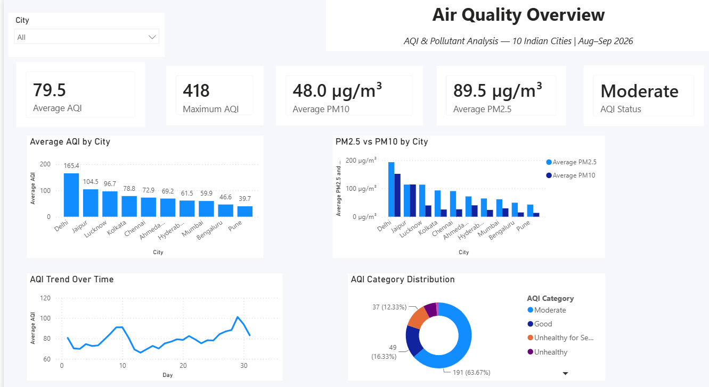
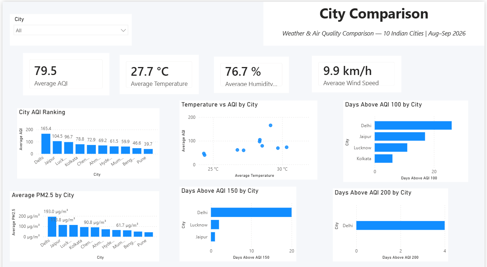
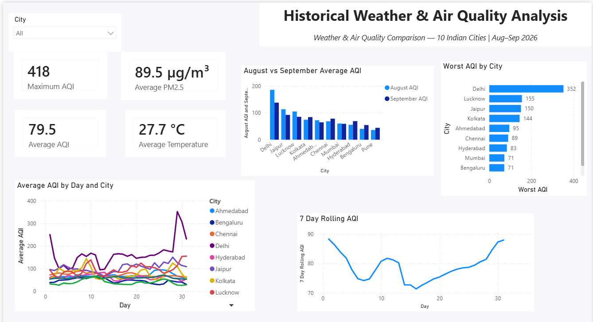

# 🌦️ Weather & Air Quality Analytics Dashboard

An end-to-end data analytics project analyzing weather and air quality across **10 Indian cities** using Python, REST APIs, MySQL, SQL, and Power BI.

## 📌 Project Overview

This project collects and analyzes 30 days of weather and air-quality data to identify:

- City-level AQI differences
- Weather trends
- Pollutant patterns
- Elevated AQI periods
- AQI trends over time
- Relationships between weather and air quality

## 🛠️ Tools & Technologies

- Python
- Pandas
- REST APIs
- MySQL
- SQL
- Power BI
- DAX
- Git & GitHub

## 📍 Cities

Delhi, Mumbai, Bengaluru, Hyderabad, Chennai, Kolkata, Pune, Jaipur, Lucknow, Ahmedabad

**Study Period:** 15 August 2026 – 13 September 2026

## 🔄 Project Workflow

```text
REST APIs
   ↓
Python Data Extraction
   ↓
Data Cleaning
   ↓
MySQL
   ↓
SQL Analysis
   ↓
Python EDA
   ↓
Power BI Dashboard
   ↓
Insights
````

## 📊 Power BI Dashboard

The dashboard contains 4 pages:

### 1. Weather Overview

* Average Temperature
* Average Humidity
* Average Wind Speed
* Average Precipitation
* Temperature trends
* City comparison



### 2. Air Quality Overview

* Average AQI
* Maximum AQI
* PM2.5
* PM10
* AQI trends
* AQI category distribution



### 3. City Comparison

* AQI ranking
* Temperature vs AQI
* PM2.5 comparison
* Days above AQI 100, 150 and 200



### 4. Historical Analysis

* 30-day AQI trend
* 7-day rolling AQI
* August vs September comparison
* Worst AQI by city



## 💡 Key Insights

* Delhi had the highest average AQI at **165.36**.
* Delhi recorded **26 days above AQI 100**.
* **PM2.5 showed the strongest correlation with AQI (0.952)**.
* Temperature had a **0.527 correlation** with AQI.
* AQI levels varied significantly across cities.

> Correlation results represent statistical associations within this dataset and do not establish causation.

## 🔎 SQL Analysis

The project includes:

* City-level AQI analysis
* Weather analysis
* Pollutant comparison
* AQI ranking
* Worst AQI day
* 7-day rolling AQI
* Persistent high-AQI analysis
* August vs September comparison
* Window functions and CTEs

## 💼 Recommendations

* Monitor cities with frequent elevated AQI
* Track PM2.5 alongside overall AQI
* Use rolling AQI to identify persistent pollution periods
* Use city-level monitoring for detailed analysis
* Extend the dataset to multiple years

## ⚠️ Limitations

* Only 30 days of data were analyzed
* Only 10 cities were included
* August and September contain different numbers of observations
* API/model-based environmental data may differ from ground monitoring stations
* Correlation does not imply causation

## 🚀 Future Improvements

* Add multiple years of historical data
* Add more Indian cities
* Integrate ground monitoring data
* Automate daily data collection
* Add Power BI scheduled refresh
* Add real-time monitoring
* Analyze seasonal patterns

## 📂 Project Structure

```text
Weather_AQI_Project/
│
├── data/
│   ├── raw/
│   └── processed/
│
├── python/
│   ├── 01_api_test.py
│   ├── 02_extract_weather.py
│   ├── 03_multi_city_weather.py
│   ├── 04_clean_weather.py
│   ├── 05_historical_weather.py
│   ├── 06_load_mysql.py
│   ├── 07_historical_air_quality.py
│   ├── 08_load_aqi_mysql.py
│   ├── 09_eda.py
│   └── 10_visualizations.py
│
├── sql/
│   ├── 01_basic_analysis.sql
│   └── 02_advanced_analysis.sql
│
├── powerbi/
│   └── Weather_AQI_Dashboard.pbix
│
├── screenshots/
│   ├── page1_weather_overview.png
│   ├── page2_air_quality.png
│   ├── page3_city_comparison.png
│   └── page4_historical_analysis.png
│
├── .gitignore
└── README.md
```

## ▶️ How to Run

Install dependencies:

```bash
pip install pandas requests sqlalchemy pymysql python-dotenv matplotlib
```

Create a MySQL database:

```sql
CREATE DATABASE weather_aqi;
```

Configure your local `.env` file with your MySQL credentials.

Run the Python scripts in the `python/` folder, perform the SQL analysis, and connect the MySQL database to Power BI.

> Never upload `.env` or database credentials to GitHub.

## 👨‍💻 Author

**Anshika Gangwar**

Aspiring Data Analyst

**Skills:** Python | SQL | MySQL | Power BI | DAX | Pandas | Data Analysis | Data Visualization

````